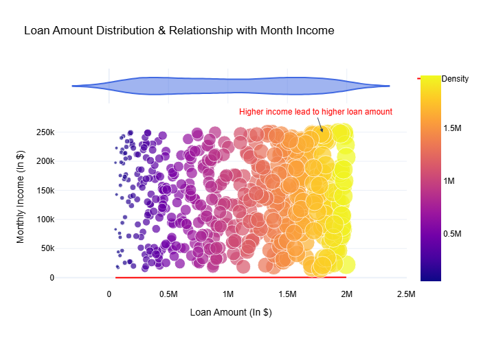
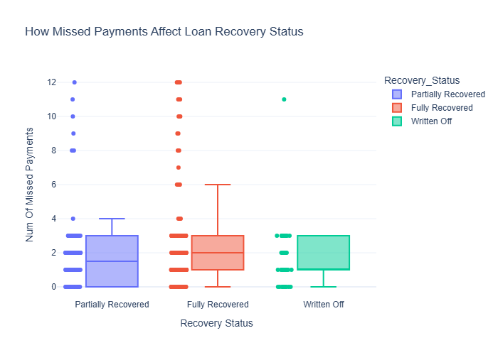
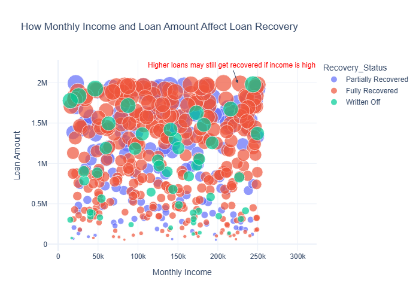
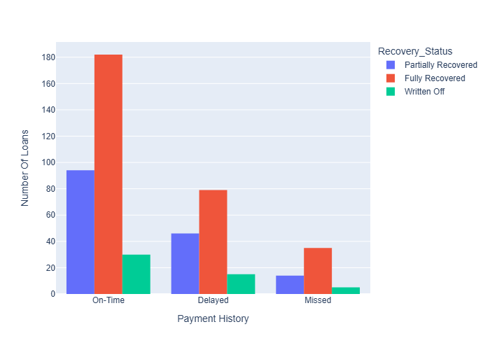
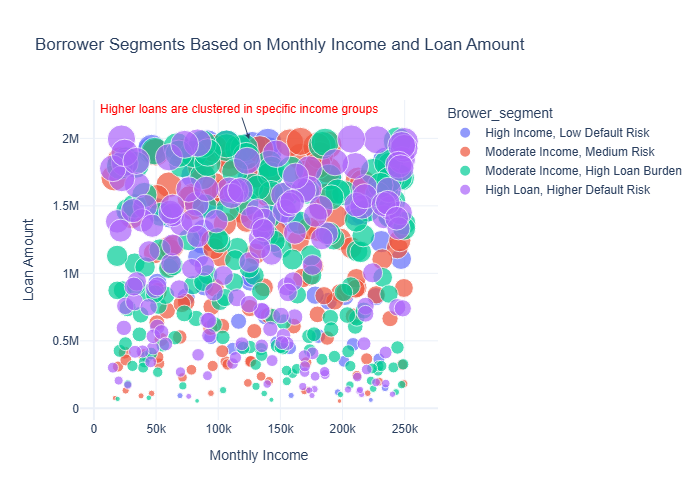

# Smart Loan Recovery System 💸

This project uses machine learning to segment borrowers and classify their risk of default. The goal is to support recovery strategy teams by identifying higher-risk borrowers based on key financial indicators.

## 🚀 Features

- 📊 Data visualization using Plotly
- 🧹 Data preprocessing pipeline
- 🤖 Clustering borrowers via KMeans
- 🌲 Classification using RandomForest
- ✅ Evaluation metrics & model export
- 📁 Modular structure for maintainability

## 📁 Project Structure

Smart-Loan-Recovery-System-With-Machine-Learning/
project_root/  
│  
├── data/  
│  
├── src/   
│ ├── main.py   
│ ├── preprocessing.py   
│ ├── model_training.py  
│ ├── segmentation.py   
│ └── visualization.py  
│  
├── ./charts/  
├── artifacts/    
├── config.yaml  
├── requirements.txt  
├── README.md  
└── .gitignore  

## 📈 Key Visualizations
- 📊 Loan Amount Distribution vs Monthly Income 

 

- 📦 Boxplot: Missed Payments vs Recovery Status

- 📌 How Monthly Income and Loan Amount Affect Loan Recovery.

- How Payment History Affects Loan Recovery Status

- 🧩 Segments of Borrowers by Loan & Income

## 🧪 Model Training & Evaluation
- 🧬 Clustering: KMeans (4 clusters)
    - Segment borrowers into risk profiles (from 0 to 4).
- 🧠 Classification: Random Forest
    - Label segments as recoverable or not.
    - Metrics:
        - ✅ Accuracy: 96%
        - 📍 Precision: 91%
        - 📈 Recall: 97%
        - 🏆 F1 Score: 94%
## 🧾 Dependencies
- Key libraries:
    - pandas, scikit-learn
    - plotly, matplotlib, seaborn
    - yaml
    - Full list in requirements.txt.